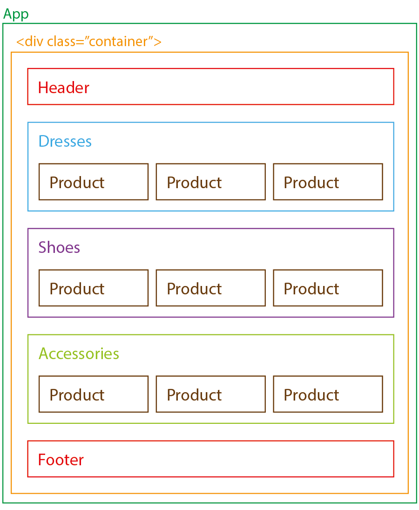

# Domácí úkol: Móda

Tvým úkolem je vyrobit aplikaci v Reactu, která bude zobrazovat jednoduchou stránku s nabídkou módy.

- [Fork zadání na GitHubu](#fork-zadání-na-githubu)
- [Instalace a spuštění](#instalace-a-spuštění)
- [Zadání úkolu](#zadání-úkolu)
- [Odevzdání úkolu](#odevzdání-úkolu)

Takto by měla celá stránka/aplikace nakonec vypadat:


## Fork zadání na GitHubu

Tentokrát **nebudeš** vytvářet aplikaci úplně od začátku pomocí `create-czechitas-app`, ale postupuj následovně:

1. Předpokládáme, že máš účet na GitHubu. Pokud ne, zaregistruj si ho a přihlaš se do něj.
2. Udělej si fork tohoto repozitáře se zadáním (tím se ti úkol zkopíruje do tvého GitHub účtu).
3. Naklonuj si repozitář ze svého GitHub účtu k sobě na disk.
4. Až budeš mít úkol hotový (viz. dále), tak nezapomeň udělat commit a push zpět na GitHub.
5. Úkol budeš odevzdávat jako odkaz na svůj GitHub repozitář se svým zpracovaným řešením.

Pokud nevíš, jak s Gitem a GitHubem pracovat, zeptej se nás na Slacku nebo se prosím podívej na následující videa. Jsou z jiného kurzu, ale vše platí víceméně i pro nás:

* [VIDEO: Úvod do Gitu](https://www.youtube.com/watch?v=hda4-ngFEWM)
* [VIDEO: GitHub](https://www.youtube.com/watch?v=JLzWjJjsLz8)
* [VIDEO: GitHub Fork](https://www.youtube.com/watch?v=K7rE3jRCjD4)


## Instalace a spuštění

1. I když ty sama jsi projekt nezakládala z nuly přes `create-czechitas-app`, tak soubory, které sis naklonovala, jsou vytvořené pomocí tohoto nástroje. Složka s úkolem se používá úplně stejně, jako bys ji sama založila pomocí `create-czechitas-app` (až na jednu výjimku, viz. dále). Složka už v sobě obsahuje i nějaké další připravené podklady - obrázky, HTML, CSS, apod.

2. Otevři si v editoru složku úkolu, kterou sis z GitHubu naklonovala k sobě na disk (nejspíš se jmenuje `ukol-moda`). Složka, kterou otevíráš v editoru, by měla obsahovat soubor `package.json` (a další soubory a složky).

3. Otevři si v editoru terminál / příkazovou řádku a zadej příkaz:

	```
	npm install
	```

	Tím se ti do projektu doinstalují všechny potřebné balíčky závislostí stejně, jako kdybys projekt od začátku vytvářela/instalovala pomocí `create-czechitas-app`.

4. Známým způsobem zkus projekt spustit. Měl by jít normálně zkompilovat a v prohlížeči by neměl v konzoli vyhodit žádnou chybu.


## Zadání úkolu

Tvým cílem je vytvořit relativně jednoduchou stránku v Reactu, která bude zobrazovat nabídku módy podobně jako v e-shopu.

1. Prozkoumej složku `html-vzor`:
	- všimni si, že není uvnitř složky `src`, takže na naši aplikaci nemá žádný vliv
	- ve složce `html-vzor` máš nakodóvané HTML a CSS výsledné stránky
	- je na tobě, abys toto HTML a CSS rozsekala na kousky, ze kterých uděláš jednotlivé komponenty a dáš je na správná místa v aplikaci
	- součástí html-vzoru je i složka `assets`, kde jsou všechny potřebné obrázky - tuto složku zkopíruj ze vzoru do složky `src`. V komponentách se pak na jednotlivé obrázky odkazuj takto ``

2. Prozkoumej složku `src`:
	- všimni si, že máš připravenou úplně prádnou aplikaci

3. Místo výchozího JSX kódu v komponentě App v `index.jsx` dej:
	```jsx
	<div class="container">
	</div>
	```

	Až je v dalších krocích vytvoříš, tak do tohoto kontejneru umístíš komponenty `<Header />`, `<Dresses />`, `<Shoes />`, `<Accessories />` a `<Footer />`.

	Rozložení komponent v celé aplikaci bude vypadat následovně:
	

4. Vytvoř komponentu `Header`, která bude obsahovat jednoduchý kód ze vzorového HTML. Komponentě přidej prop `title`, pomocí které do komponenty půjde poslat obsah hlavního nadpisu. Ve vzorovém HTML je to `Móda`. Komponentu naimportuj a vlož do kontejneru v hlavní komponentě App.

	Pro komponentu `Header` vytvoř i její vlastní CSS soubor a nezapomeň ho do komponenty naimportovat. Ze vzoru vykousni CSS týkající se hlavičky a vlož ho do CSS souboru u komponenty.

5. Podobným způsobem vytvoř komponentu `Footer` a její vlastní CSS soubor, do kterého nakopíruj CSS týkající se patičky. Komponenta bude mít dvě props `year` a `author`, pomocí kterých předáš do patičky rok a autora stránky - např. 2022 a Czechitas.


5. Podle obrázku s rozložením komponent (viz výše) vidíš, že musíš vytvořit komponenty `<Dresses />`, `<Shoes />`, `<Accessories />`. Všechny tyto komponenty budou víceméně stejné.

	Kdybychom toho z Reactu uměli o trochu víc, udělali bychom jednu univerzální komponentu, která by byla schopná obsloužit všechny tři kategorie zboží. Zatím toho ale umíme jen málo, takže si vytvoříme samostatně všechny tři komponenty, i když struktura jejich HTML kódu bude v podstatě shodná, až na text v nadpisu. Každá komponenta bude mít i svůj vlastní CSS soubor.

	V HTML vzoru vidíme, že každá kompomenta pro kategorii produktů vypadá nějak takto:
	```html
	<section class="...">
		<h2>Název kategorie</h2>
		<div class="products">

			... a zde je seznam zboží

		</div>
	</section>
	```

	Každá kategorie zboží (šaty, boty, doplňky) obsahuje tři různé produkty. HTML pro jednotlivé produkty nebudeme do komponent kopírovat přímo, ale vytvoříme si novou speciální komponentu `<Product />` pro zobrazení jednoho produktu, kterou pak použijeme uvnitř všech komponent `<Dresses />`, `<Shoes />`, `<Accessories />`

6. Vytvoř novou komponentu `Product` a její vlastní CSS soubor. Ze vzoru do komponenty i do CSS nakopíruj příslušný HTML a CSS kód.

	Komponenta bude přijímat čtyři props: `image`, `name`, `description` a `price`. Jejich hodnoty použij pro zobrazení názvu zboží, popisu, ceny a obrázku produktu.

	Očekáváme, že do prop `image` se bude předávat pouze název souboru s obrázkem, např. `red-dress.jpg`. Ty ale v komponentě musíš zařídit, aby se do atributu `src` u obrázku dostala plná cesta k souboru, která by měla vypadat jako `/assets/red-dress.jpg`.

7. Do komponent `<Dresses />`, `<Shoes />`, `<Accessories />` do každé naimportuj komponentu `<Product />` a v místě, kde má být seznam zboží ji 3x použij a předej do ní jako props název, popis a cenu pro konkrétní zboží, které tam chceš zobrazit.


## Odevzdání úkolu

1. Nezapomeň udělat `commit` a potom `push` do GitHub repozitáře.

2. Odkaz na repozitář odevzdej jako řešení úkolu v [moje.czechitas.cz](https://moje.czechitas.cz).

